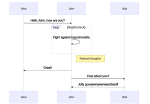

# Insert Image from Mermaid

This [Zim](https://github.com/zim-desktop-wiki/zim-desktop-wiki "Zim - A Desktop Wiki Editor") plugin allow you to insert a [Mermaid](https://github.com/mermaid-js/mermaid "Generation of diagram and flowchart from text in a similar manner as markdown") illustration in pages.

# Installation

```bash
# step 1 - install dependencies
apt-get install imagemagick
npm install -g @mermaid-js/mermaid-cli

# step 1 - install this plugin
git clone https://this/repo.git ~/.local/share/zim/plugins/insert_mermaid/

# step 3 - restart Zim to load this plugin

# step 4 - enable this plugin
# In Edit > Preferences > Plugins tab, you can now tick Insert Image form Mermaid.

```

# Example 

with the following scripts:
```
%% {"width": "300", "height": "300"}
sequenceDiagram
Alice->>John: Hello John, how are you?
loop Healthcheck
    John->>John: Fight against hypochondria
end
Note right of John: Rational thoughts!
John-->>Alice: Great!
John->>Bob: How about you?
Bob-->>John: Jolly gooqwerqwerwqerd!asdf
```

you will get the following image:



# About the image size...

We should use `mmdc --width 123 --height 456` to control the image size, but this command doesn't work as we expect. 

The first line in the script, `%% {"width": "300", "height": "300"}`, is used to control the image size, which is passed to `convert(1)`. 